# Grama-Yatri: Community-Powered Rural Bus Tracking App

> A native Android application that helps rural village commuters track bus locations, view weekly schedules, report live bus sightings, and receive real-time ETAs — powered by community participation and Firebase Realtime Database.

---

## Project Overview

Grama-Yatri addresses a critical gap in rural public transportation: the complete absence of real-time bus information for village commuters. In most rural areas of Karnataka, bus schedules are communicated only through word-of-mouth, and missing a bus by even two minutes can mean waiting three or more hours for the next service.

This app replaces the need for GPS hardware on buses by turning passengers into the tracking network. When a passenger spots or boards the bus, they report its location through the app. The system instantly calculates ETAs for all downstream stops and pushes that information to every user on the route in real time.

---

## Problem Statement

Village bus timings are highly unpredictable. Daily wage workers, students, and rural commuters frequently miss buses and are forced to wait for hours — losing income, missing college, and arriving late to work. Installing GPS devices on every rural bus is not always practical due to cost and infrastructure constraints.

Grama-Yatri solves this by enabling the passenger community itself to serve as the reporting network, using only their smartphones and a Firebase-backed Android app.

---

## Key Features

- **Weekly Bus Schedule** — Monday through Sunday tabs allow users to view routes active on any day of the week. The current day is auto-selected on launch.
- **Day-Specific Route Cards** — Each route card shows the bus operator (KSRTC / BMTC / Private), bus plate number, and departure times for the selected day.
- **Route Health Dashboard** — Aggregate summary showing routes running today, active alerts, total reports, and last updated time. Each route card includes a health chip: Good, Moderate, Attention Needed, or No Recent Data.
- **Live Tracking Timeline** — A vertical stepper view showing all stops on the route with live ETAs and reporter attribution per stop.
- **Ping Bus** — Users can report the bus location at any stop with a single tap. Supports two report types: "I am on the bus" and "Bus just passed me".
- **ETA Calculation** — ETAs for all downstream stops are calculated automatically using the ping timestamp and average inter-stop travel times stored in Firebase.
- **serviceDateKey-Based Daily Separation** — Pings and alerts are keyed by a daily service date, preventing stale data from previous days from mixing with live operational data.
- **Alerts Reporting** — Users can report cancellations, delays, and other route information. Active alerts are surfaced as a red banner on the Live Tracking screen.
- **Local Alert Dismissal** — Users can dismiss alerts locally without modifying Firebase data. Dismissed state is stored in SharedPreferences per device session.
- **Profile Screen** — Users can set their display name, preferred home stop, and app language. Settings persist across sessions.
- **Kannada Language Support** — Full Kannada UI via Android string resources, selectable from the Profile screen. The selected language is saved locally in SharedPreferences and applied via activity recreate.
- **Voice Assist / Text-to-Speech** — Speaker buttons on key screens read bus status, ETAs, and alert content aloud using the Android TextToSpeech API. Graceful fallback if Kannada TTS is unavailable on the device.
- **Low-Data Modern UI** — No maps, no remote images, no heavy animations. Designed to run on 2G networks and low-end Android devices.

---

## Screenshots

> Screenshots captured from the application running on an Android device.

---

### Core App Flow

| Splash / Onboarding | Home — English | Home — Alert Active |
|---|---|---|
| 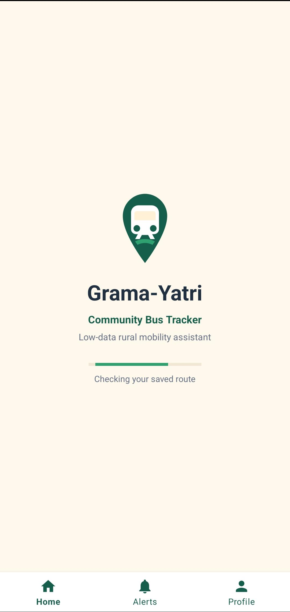 | 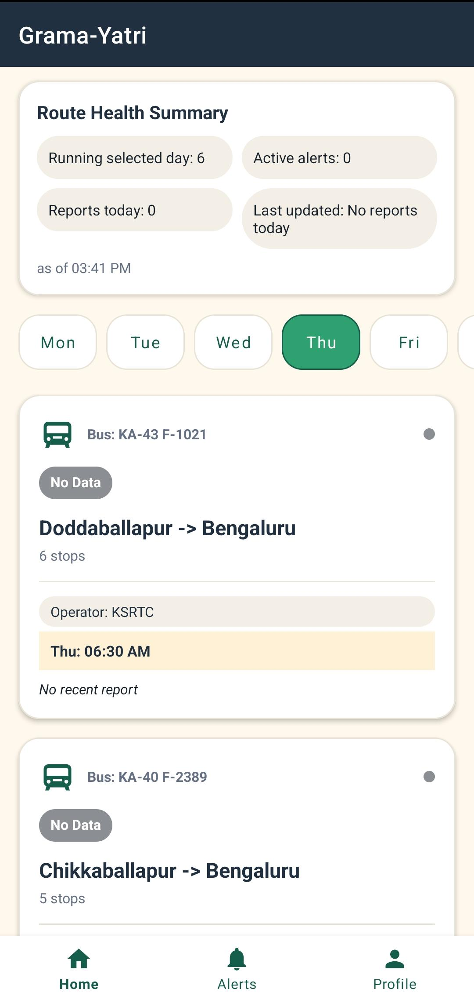 | 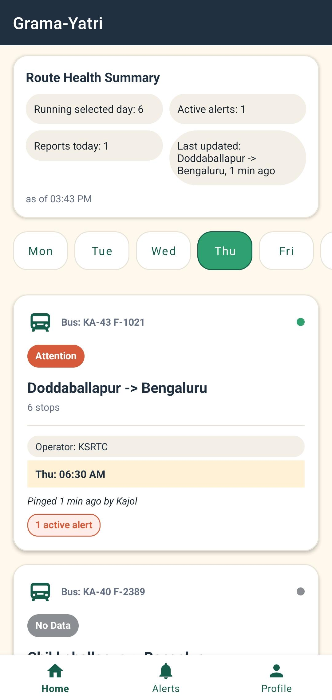 |
| App launch screen with branding and onboarding entry point | Home screen showing weekly schedule tabs, route cards with operator, bus number, and route health status | Home screen with an active alert banner surfaced on a route card |

---

### Live Tracking and Ping Flow

| Live Tracking — No Report | Live Tracking — After Ping | Ping Bus Bottom Sheet |
|---|---|---|
| 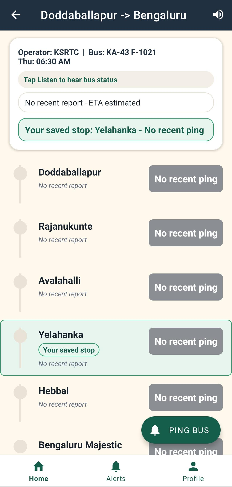 | 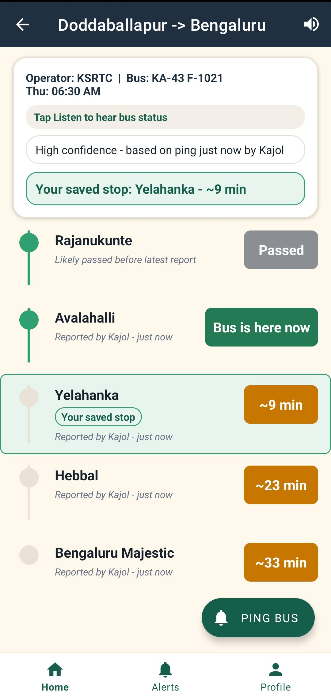 | 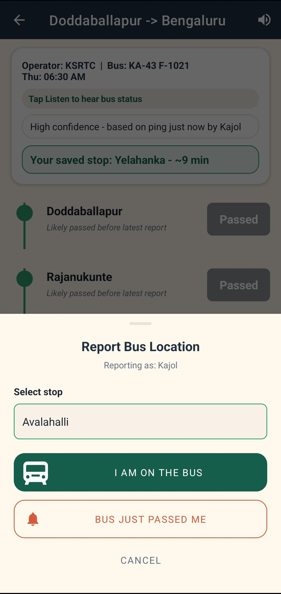 |
| Route timeline with no live data — stops shown with no ETA | Route timeline updated after a community ping — ETAs calculated and reporter attribution displayed per stop | Ping Bus bottom sheet — user selects stop and report type before submitting |

---

### Alerts Flow

| Report an Alert | Alerts Screen |
|---|---|
| 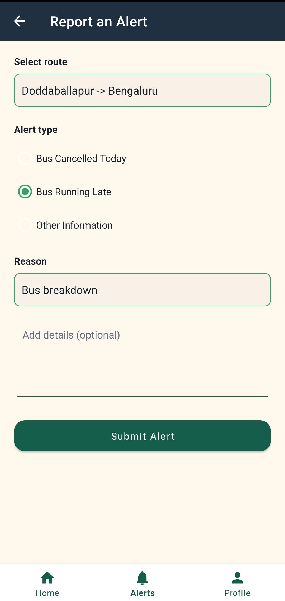 | 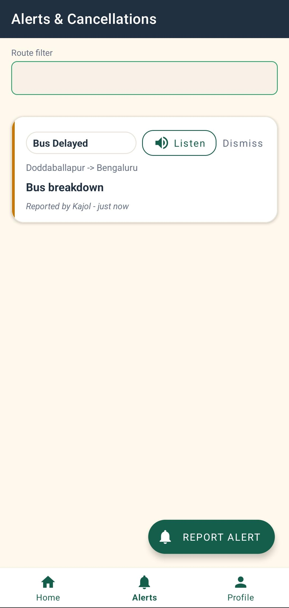 |
| Alert reporting screen — user submits a cancellation or delay notice | Alerts screen listing active and resolved route alerts with status badges |

---

### Kannada and Accessibility

| Home — Kannada | Live Tracking — Kannada | Alerts — Kannada | Profile |
|---|---|---|---|
| 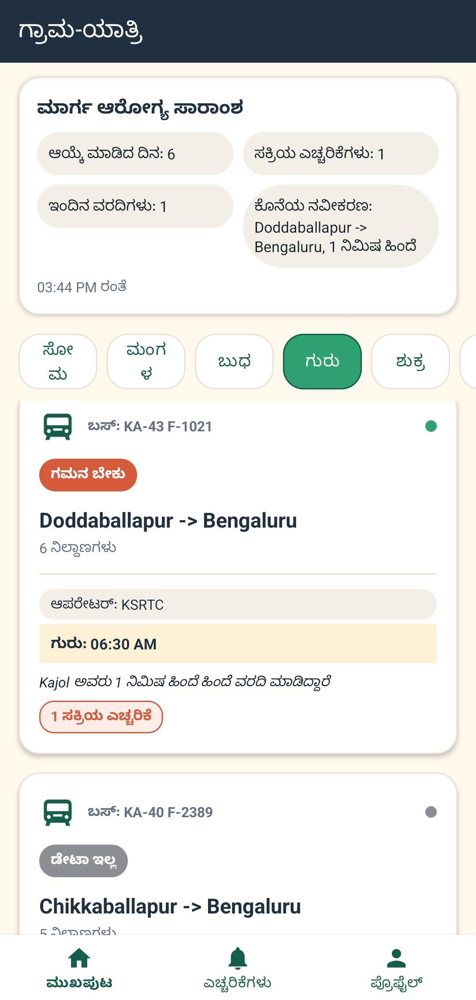 | 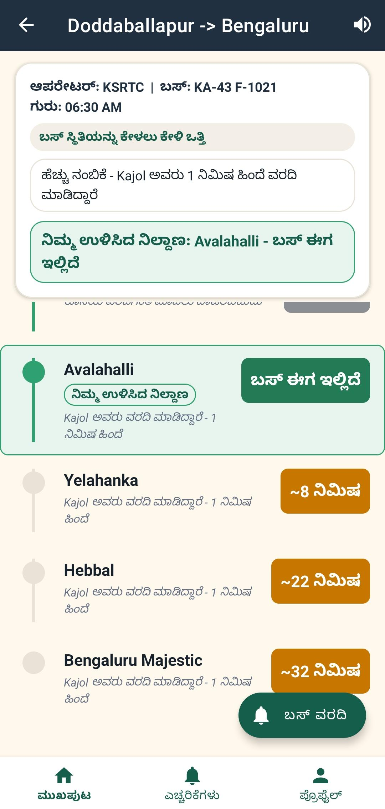 | 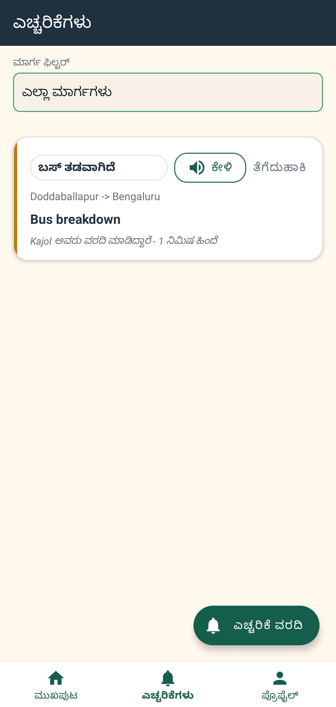 | 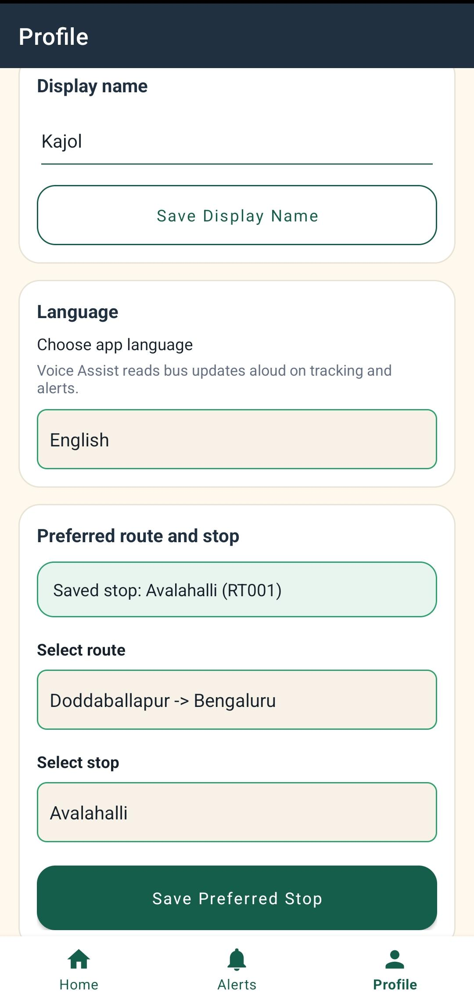 |
| Home screen with full Kannada UI — weekday tabs, route cards, and health labels in Kannada | Live Tracking timeline rendered in Kannada — stop names, ETA labels, and reporter attribution | Alerts screen in Kannada — alert messages and status chips translated | Profile screen — display name, preferred stop, language selector, and Voice Assist settings |

---
---

## Tech Stack

| Category | Technology |
|---|---|
| IDE | Android Studio (Ladybug / Panda) |
| Language | Kotlin |
| UI | XML Layouts + ViewBinding |
| Architecture | MVVM (Model-View-ViewModel) |
| Real-Time Database | Firebase Realtime Database |
| Authentication | Firebase Anonymous Authentication |
| Dependency Injection | Hilt |
| Annotation Processing | KSP (Kotlin Symbol Processing) |
| Navigation | Jetpack Navigation Component |
| Lists | RecyclerView + DiffUtil |
| Local Storage | SharedPreferences |
| Accessibility | Android TextToSpeech API |
| Minimum SDK | API 23 (Android 6.0 Marshmallow) |
| Target SDK | API 34 (Android 14) |

---

## Architecture

Grama-Yatri follows a strict **MVVM + Repository** pattern with a unidirectional data flow:

```
UI Layer (Fragments + XML)
        │  observes LiveData / StateFlow
        ▼
ViewModel Layer (RouteViewModel, PingViewModel, AlertViewModel)
        │  calls repository methods
        ▼
Repository Layer (RouteRepository, AlertRepository, UserPrefsRepository)
        │                                  │
        ▼                                  ▼
Firebase Data Source               SharedPreferences
(FirebaseManager)                  (user name, route, stop,
        │                           language, dismissed alerts)
        ▼
Firebase Realtime Database (Google Cloud)
```

**Key architecture rules:**
- Fragments never access Firebase directly. All data flows through the ViewModel and Repository.
- ViewModels expose `LiveData` or `StateFlow` only — no Android context dependency where avoidable.
- `UserPrefsRepository` encapsulates all SharedPreferences reads and writes, keeping preference logic out of ViewModels and Fragments.
- All Firebase listeners are removed in `onDestroyView()` to prevent memory leaks.

---

## Firebase Database Structure

```
/routes
  /{routeId}
    /meta          — route name, stop count, active status
    /busOperator   — KSRTC / BMTC / PRIVATE / SCHOOL / OTHER
    /busNumber     — e.g. KA-43 F-1021
    /weeklySchedule
      /MONDAY      — startTimes: ["06:30", "17:30"], active: true
      /TUESDAY     — startTimes: ["06:30", "17:30"], active: true
      ...
      /SUNDAY      — startTimes: [], active: false
    /stops
      /{stopId}    — name, index, avgTimeToNextMin
    /etas
      /{stopId}    — eta (formatted time), reportedBy, timestamp, pingType

/pings
  /{routeId}
    /{pingId}      — stopId, stopIndex, reportedBy, timestamp, pingType,
                     serviceDateKey (field, e.g. "2026-05-14"),
                     serviceDayKey (field, e.g. "WEDNESDAY")

/alerts
  /{routeId}
    /{alertId}     — message, reportedBy, timestamp, resolved,
                     serviceDateKey (field, e.g. "2026-05-14"),
                     serviceDayKey (field, e.g. "WEDNESDAY")
```

**Node summary:**

| Node | Purpose |
|---|---|
| `/routes/{id}/meta` | Route metadata — name, stop count, active flag |
| `/routes/{id}/weeklySchedule` | Fixed weekly timetable — not modified by the app at runtime |
| `/routes/{id}/stops` | Ordered list of stops with average travel times to the next stop |
| `/routes/{id}/etas` | Live ETAs per stop — written by the app after a ping is received |
| `/pings/{routeId}` | Community bus location reports for the route. Each ping document includes `serviceDateKey` and `serviceDayKey` fields to allow filtering by day without nested path levels. |
| `/alerts/{routeId}` | User-reported cancellations and delays. Each alert document includes `serviceDateKey` and `serviceDayKey` fields for the same purpose. |

---

## How the App Works

1. **Route Selection** — On first launch, the user enters a display name and selects their bus route. The selection is saved in SharedPreferences and remembered on subsequent launches.

2. **Weekly Schedule** — The Home screen displays weekday tabs (Mon–Sun). The current day is auto-selected. Only routes marked active for that day are shown, with their day-specific departure times.

3. **Live Tracking** — Tapping a route opens the Live Tracking screen — a vertical timeline showing all stops, with the current known bus position highlighted and ETAs displayed per downstream stop.

4. **Pinging Bus Location** — A passenger who spots or boards the bus taps the "Ping Bus" button, selects their stop, and chooses their report type. The app writes the ping to `/pings/{routeId}` in Firebase, including `serviceDateKey` and `serviceDayKey` fields to allow day-based filtering without nested path levels.

5. **ETA Calculation** — When a ping is received, `EtaCalculator` computes the arrival time at every downstream stop using the formula:

   ```
   ETA[stop_j] = PingTimestamp + Sum(avgTimeToNextMin[i → j-1])
   ```

   The calculated ETAs are written to `/routes/{id}/etas/` and immediately pushed to all connected users via Firebase's `ValueEventListener`.

6. **Alerts** — Any user can report a cancellation or delay. The alert appears as a red dismissible banner on the Live Tracking screen and is listed on the Alerts screen. Users can dismiss it locally without affecting Firebase.

7. **Route Health Dashboard** — The Home screen shows a summary card with routes running today, active alert count, reports today, and last updated time. Each route card shows a health chip calculated from ping recency and alert status — entirely client-side, using data already loaded.

8. **Kannada and Voice Assist** — Users can switch to Kannada from the Profile screen. The selected language is saved locally and applied via activity recreate. Speaker buttons on key screens use the Android TextToSpeech API to read bus status and alerts aloud — useful for users with low reading literacy.

---

## Setup Instructions

### Prerequisites

- Android Studio Ladybug or Panda
- A Firebase project with Realtime Database and Anonymous Authentication enabled
- JDK bundled with Android Studio (JBR). If AGP 9 or later is used, Java 21 may be required — Android Studio's bundled JBR should satisfy this automatically.

### Steps

**1. Clone the repository**

```bash
git clone https://github.com/your-username/grama-yatri.git
cd grama-yatri
```

**2. Open in Android Studio**

Open the project folder in Android Studio. Wait for Gradle sync to complete.

**3. Add Firebase configuration**

- Go to [Firebase Console](https://console.firebase.google.com) and create a new project (or use an existing one).
- Add an Android app with package name `com.gramayatri.app`.
- Download `google-services.json` and place it inside the `/app` directory.

**4. Enable Firebase services**

In Firebase Console:
- **Realtime Database** — Create the database. Set the rules to allow read/write for development:
  ```json
  { "rules": { ".read": true, ".write": true } }
  ```
- **Anonymous Authentication** — Go to Authentication > Sign-in method and enable Anonymous.

**5. Seed Firebase data**

Populate the database with at least one route using the JSON structure described in the [Firebase Database Structure](#firebase-database-structure) section. The app does not auto-create route data — route and schedule data is admin-managed.

**6. Sync and run**

Sync Gradle in Android Studio and run the app on a physical device or emulator (API 23+).

---

## Build Command

To build a debug APK from the command line on Windows:

```powershell
$env:JAVA_HOME="C:\Program Files\Android\Android Studio\jbr"
$env:Path="$env:JAVA_HOME\bin;$env:Path"
.\gradlew.bat assembleDebug
```

The output APK will be located at:

```
app/build/outputs/apk/debug/app-debug.apk
```

---

## Known Limitations

| Limitation | Details |
|---|---|
| Community-dependent ETA | ETA accuracy depends on passengers actively reporting bus location. Routes with no recent pings show no live data. |
| No push notifications | Cancellation alerts are visible only when the app is open. FCM push notifications are planned for a future release. |
| Manually seeded route data | Route names, stops, schedules, and bus details are managed directly in Firebase Console. No in-app admin interface exists yet. |
| Kannada TTS device dependency | Voice Assist in Kannada requires the Google Text-to-Speech language pack for Kannada to be installed on the device. A graceful fallback message is shown if unavailable. |
| No admin dashboard | Route coordinators must update Firebase data manually via the Firebase Console. |
| No GPS integration | Bus location is derived entirely from community reports. GPS tracking on vehicles is not implemented. |

---

## Future Scope

- **FCM Push Notifications** — Broadcast cancellation and delay alerts to all route subscribers even when the app is closed, using Firebase Cloud Messaging and Cloud Functions.
- **Admin Dashboard** — An in-app or web-based interface for route coordinators to manage routes, stops, schedules, and bus details without accessing Firebase Console directly.
- **Cloud Functions** — Server-side automation for alert broadcasting, stale data cleanup, and schedule management.
- **GenAI / Gemini ETA Refinement** — Use historical ping data to automatically improve the `avgTimeToNextMin` values per stop using machine learning.
- **Additional Languages** — Hindi, Tamil, and Telugu support following the same string resource pattern used for Kannada.
- **Offline Cache** — Implement Room Database to cache route schedules, ETAs, and alerts locally, making the app fully usable without an active internet connection.
- **Driver / Operator Mode** — A dedicated mode for bus drivers or conductors to report bus position with verified authority, weighted more heavily in ETA calculations.
- **QR Code at Bus Stops** — QR codes placed at physical bus stops that open the correct route in the app directly, removing the need for manual route selection.

---

## Learning Outcomes

This project provided hands-on experience with:

- **Native Android development** — Kotlin, XML layouts, RecyclerView with DiffUtil, ViewBinding, and Fragment lifecycle management.
- **Firebase real-time synchronisation** — Designing a NoSQL schema, attaching `ValueEventListener`, writing data atomically, and managing real-time data flow across connected clients.
- **MVVM architecture** — Clean separation of UI, ViewModel, and Repository layers with LiveData and StateFlow.
- **Hilt dependency injection** — Module setup, component scoping, and KSP annotation processing for compile-time DI.
- **Jetpack Navigation Component** — NavGraph, Safe Args for type-safe navigation, and back-stack management.
- **Localisation and accessibility** — Android string resources for multi-language support, `LanguageManager` for runtime locale switching, and Android TextToSpeech for voice-assisted access.
- **UI/UX for constrained environments** — Designing for 2G networks, low-end devices, and users with varying levels of digital and reading literacy.

---

## Author

**Mohammed Fawwaz Sadath**  
B.E. Electronics and Communication Engineering  
BMS Institute of Technology and Management, Bengaluru  
USN: 1BY22EC054

*Developed as part of the Android App Development using Gen AI internship at MindMatrix.io / CL Infotech Pvt. Ltd.*

---

## License

This project was developed for academic and internship purposes. Licensing terms to be defined before public release.
